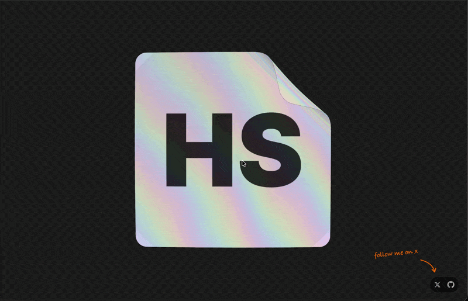

# Holosticker



<p>
  <a href="https://holosticker.dev"></a>
  <a href="https://github.com/jal-co/holosticker/stargazers"></a>
  <a href="https://github.com/jal-co/holosticker/blob/main/LICENSE"></a>
  <a href="https://github.com/jal-co/holosticker/commits/main"></a>
  <a href="https://github.com/sponsors/jal-co"></a>
</p>

Holographic sticker studio. Upload an SVG or PNG, tune the foil, tilt it with your cursor, and export a realistic holofoil sticker as a transparent PNG.

**Live at [holosticker.dev](https://holosticker.dev)**

## Features

- Real-time three.js rendering: PBR holofoil with view-dependent diffraction bands, thin-film iridescence, metallic flakes, and studio environment reflections
- Pointer tilt: rainbow bands sweep across the foil like a real holo card
- Die-cut border from an exact euclidean distance transform, with cut tolerance (morphological closing) so letter counters and small gaps stay foil like a real cut path
- Ink control: fade artwork into the foil or densify it into solid print that covers the holo
- Refractor overlays: triangle, square, and stripe facet patterns with per-facet diffraction phase
- 3D peel: graded hinge bend with conical curl and a glossy foil liner backside
- Dark mode (toggle in the toolbar, or press <kbd>D</kbd>)
- Save / import settings as JSON; export PNG at 1024 / 2048 / 4096 with transparency

## Run

```sh
npm install
npm run dev
```

## Stack

Vite, React, TypeScript, Tailwind CSS v4, shadcn/ui, three.js. Deployed on Vercel.

## Deploy

The app is a static Vite build - Vercel auto-detects it:

```sh
vercel --prod
```

## Support

If Holosticker is useful to you, consider [sponsoring jal-co on GitHub](https://github.com/sponsors/jal-co).

<a href="https://github.com/sponsors/jal-co"></a>
